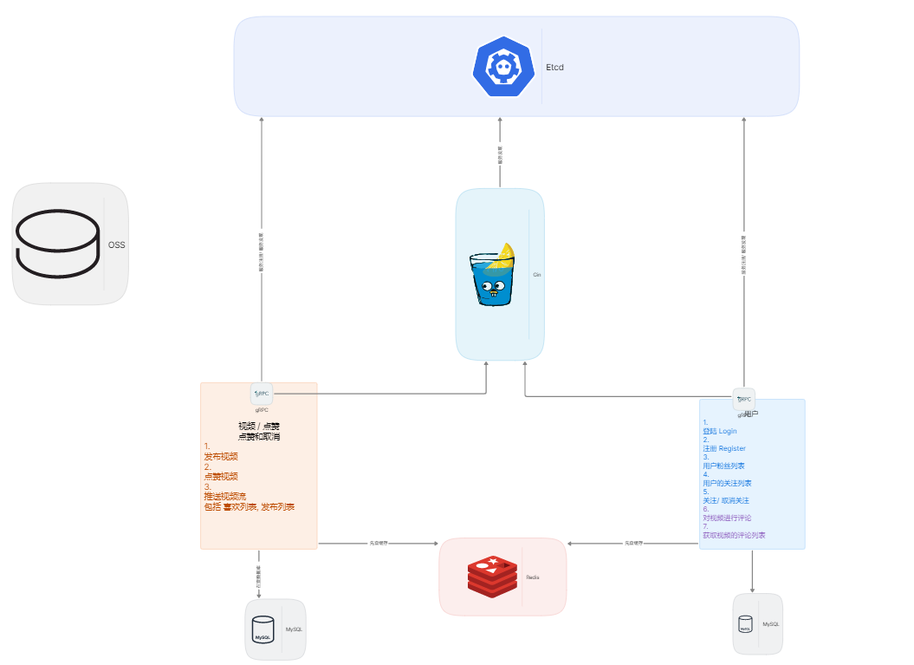
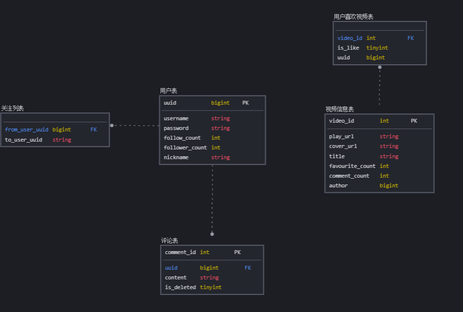
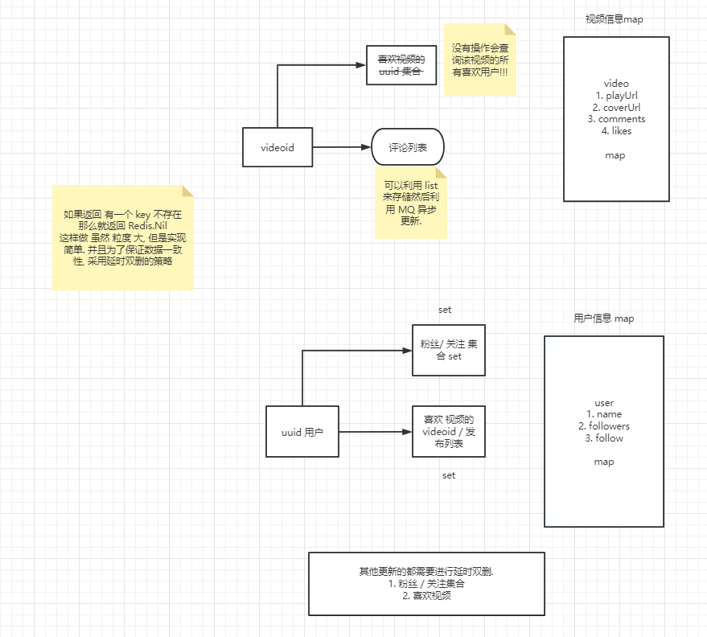
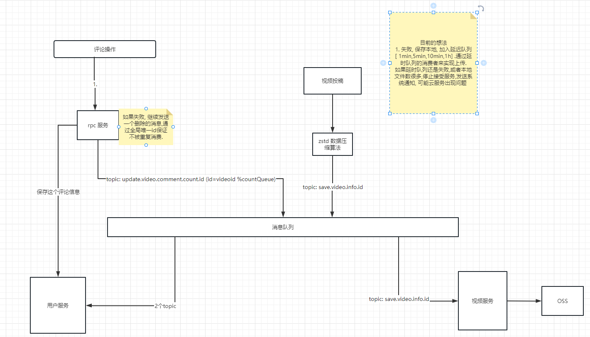

# DY2023  

2023字节青训营---抖音项目---卷王小分队

项目整体结构参照 `easy_note` 结构来构建


resources ：

    image : 图片资源png、jpg
    video ： 视频资源mp4
    application.yaml ：数据配置文件，例如mysql配置，redis配置
## 项目目录
```
├── build    
├── idl     -- 接口定义文件 
├── pkg     -- 工具包 
│   ├── configs
│   │   └── sql -- 建表
│   ├── constants -- 常量 配置相关
│   ├── errno  -- 错误码
│   ├── middleware -- gin 中间件
│   ├── mq -- 消息队列
│   ├── redis -- 缓存
│   │   ├── user 
│   │   └── video
│   ├── storage -- 上传接口实现
│   ├── upload
│   └── util -- 工具
└── service
    ├── api -- gin 对外暴露的接口层
    │   ├── handlers
    │   │   ├── common 
    │   │   ├── user -- 请求
    │   │   └── video
    │   ├── router
    │   └── rpc  -- 调用 rpc
    │       ├── mock
    │       │   └── user
    │       ├── pack
    │       ├── user
    │       │   └── pack
    │       └── video
    │           └── pack
    ├── user -- 用户微服务
    │   ├── handler 
    │   ├── model -- 数据库
    │   │   └── db
    │   ├── pack
    │   ├── service 
    │   │   ├── chat
    │   │   ├── comment
    │   │   ├── follow
    │   │   └── user
    │   └── tmp
    └── video -- 视频服务
        ├── model -- 数据库
        │   └── db
        ├── pack 
        ├── service
        └── tmp

```

## TODO
打算将自己的储存项目整合进来, 两个项目结合起来.

## 总体架构



## 表结构设计
其中 `id` 都是通过 雪花算法 生成.



# 下面的优化

自己的一些看法, 欢迎指正+批评`=-=`

## Redis 




## MQ



